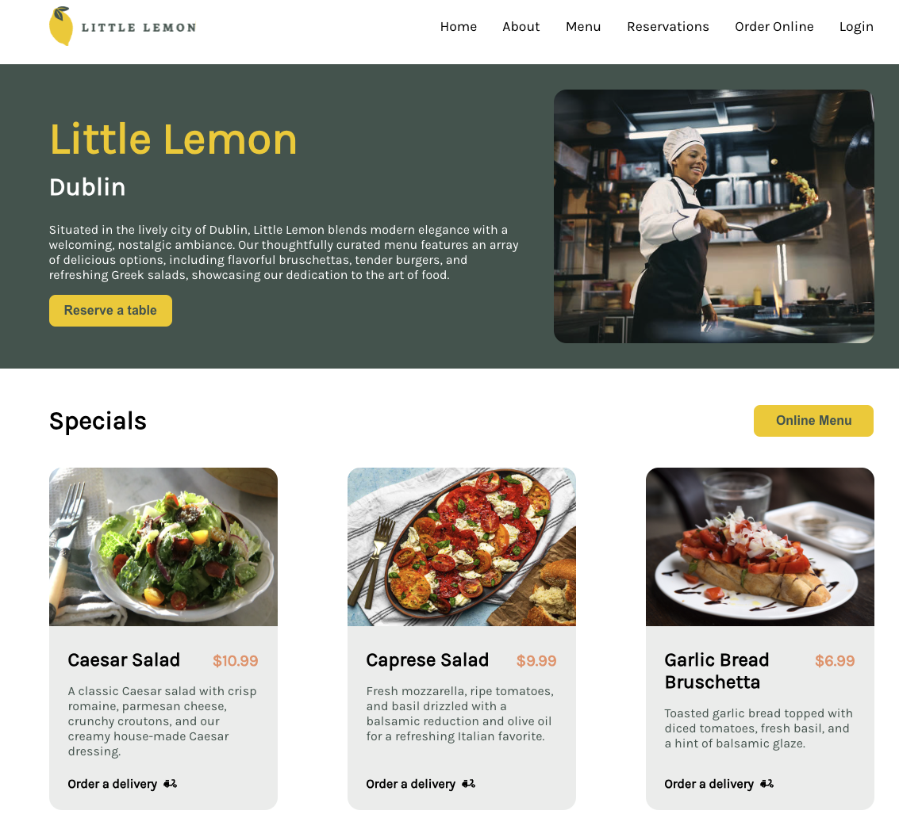

# Little Lemon :lemon:

Welcome to the Little Lemon Restaurant website repository. This project was created as a part of the Meta Frontend Developer course. It is built using React and offers a stylish interface for users who want to explore the restaurant's menu and make reservations.



## Features

- **Smooth Navigation:** Easily explore different pages of the website.
- **Stylish Menu:** Browse the restaurant's menu with a modern, appealing layout.
- **Reservation Form:** Make reservations using an interactive form.
- **Confirmation Popup:** Receive a confirmation popup upon successfully making a reservation.
- **React-Powered:** Built with React to ensure a modern and interactive user experience.

## Getting Started

To get a local copy of the project up and running, follow these steps.

### Prerequisites

- [Node.js](https://nodejs.org/) (v14 or later)
- [npm](https://www.npmjs.com/) (comes with Node.js)

### Installation

1. **Clone the repository:**

   ```bash
   git clone https://github.com/alominum/front-end-little-lemon.git
   cd front-end-little-lemon
   ```
